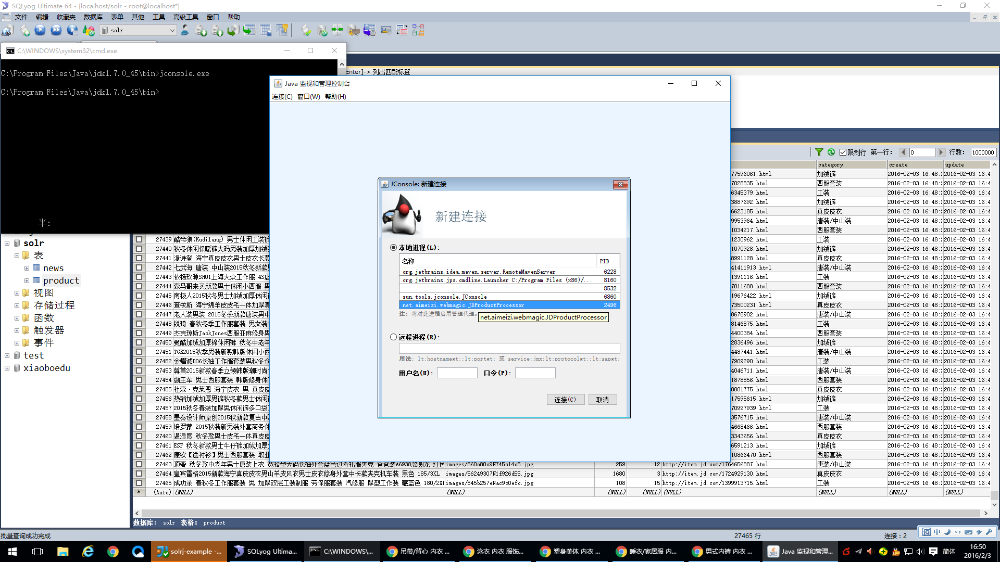
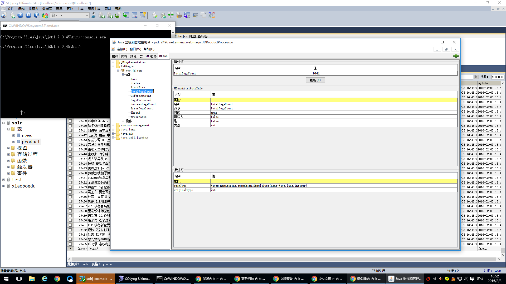
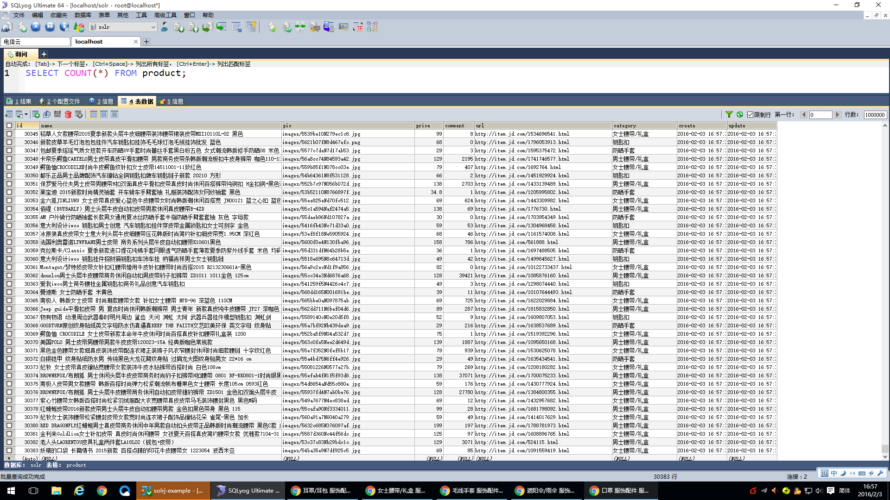
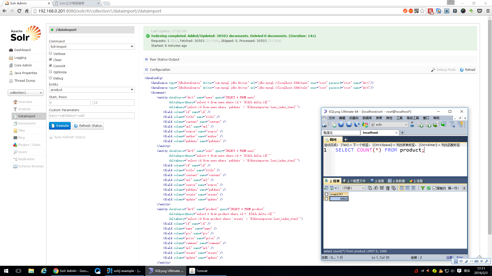
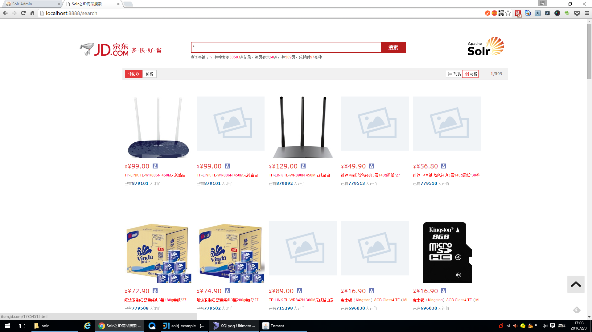
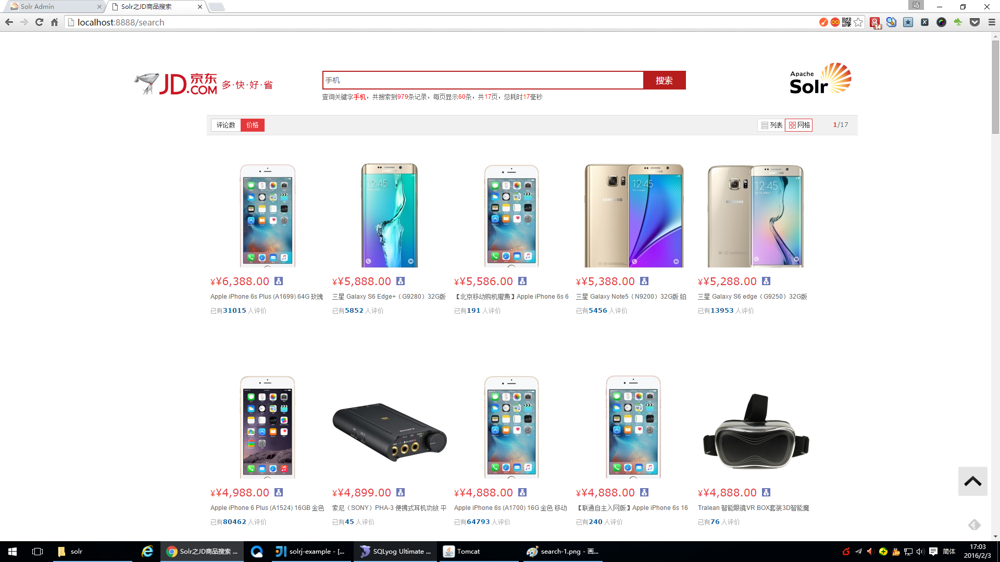
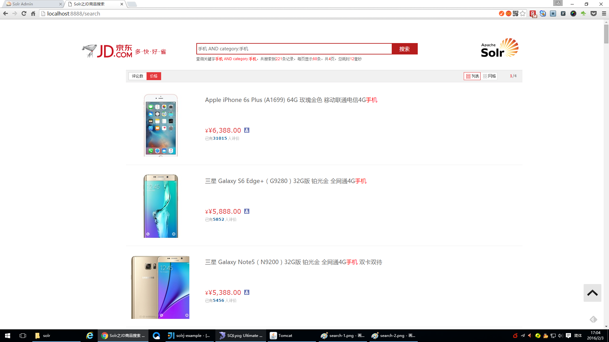
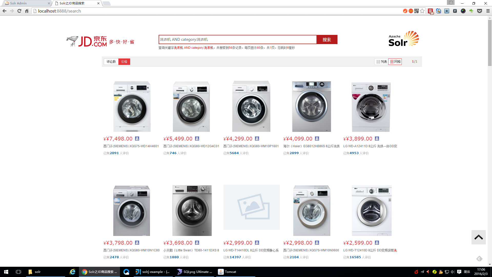
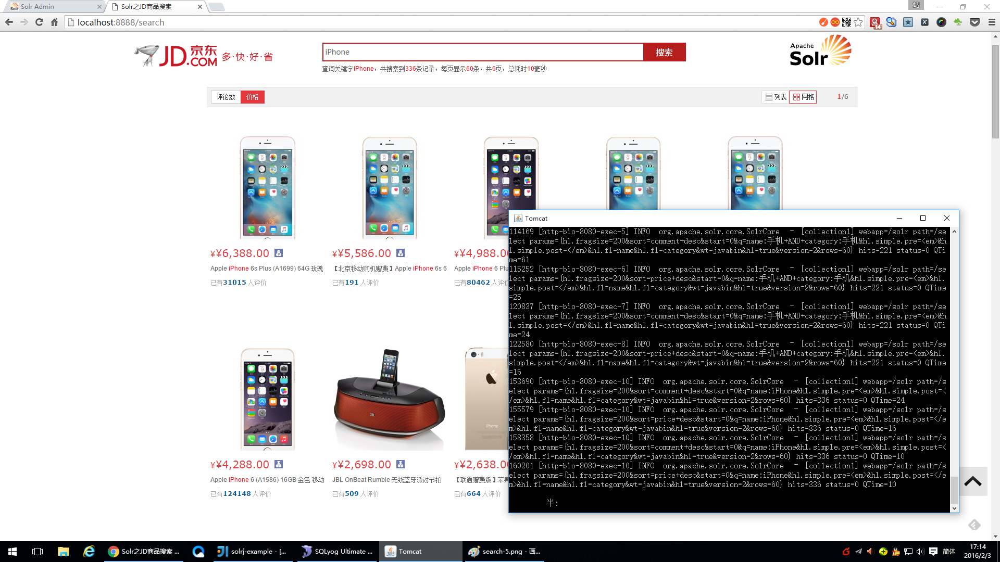

# solrj-example

solrj+webmagic+selenium示例

使用webmagic和selenium-java爬取京东商品信息并入库MySQL。采用solr dataimport创建索引，采用solrj检索商品信息。

# solr单机模式

https://coding.net/u/aimeizi/p/solr/git

基于solr4.10.4集成IKAnalyzer、mmseg4j、ansj中文分词及Dataimport功能

# solr集群模式

https://coding.net/u/aimeizi/p/SolrCloud/git

solr集群模式。基于solr4.10.4集成IKAnalyzer、mmseg4j、ansj中文分词及Dataimport等功能

# 运行

JDProductProcessor 是JD商品采集的入口，main方法直接运行。

CcdiPageProcessor 是纪检委网站采集的入口，main方法直接运行。

启动solr服务，运行爬虫采集程序，启动搜索服务，完成搜索。

# Screenshots

webmagic jmx监控

webmagic jmx监控查看总抓取页数

webmagic爬取JD商品数据入库数据

solrdataimport数据导入

solr搜索 查询`所有商品`按`评论降序`排列，以`表格`的方式展现

solr搜索 查询`名称`为`手机`的商品按`价格降序`排列，以`表格`的方式展现

solr搜索 查询`名称`为`手机`且过滤`产品类别为手机`的商品信息按`价格降序`，以`列表`的方式展现

solr搜索 查询名称为`洗衣机`且过滤`产品类别为洗衣机`的商品信息按`价格降序`，以`表格`的方式展现

solr搜索 查询名称为`iPhone`的商品信息按`价格降序`，以`表格`的方式展现

# 参考文档

http://webmagic.io/docs/zh/